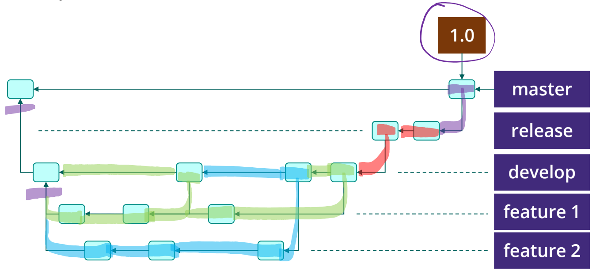

# GroupK_CGIAR_Farm_Datasets_BackEnd
An API for querying the RHoMIS data-base.\
Based on [RHoMIS 2.0 API](https://github.com/l-gorman/rhomis-api).\
The front-end of this project is [GroupK_CGIAR_Farm_Datasets_FrontEnd](https://github.com/Patanga/GroupK_CGIAR_Farm_Datasets_FrontEnd.git).

## Branches Diagram

